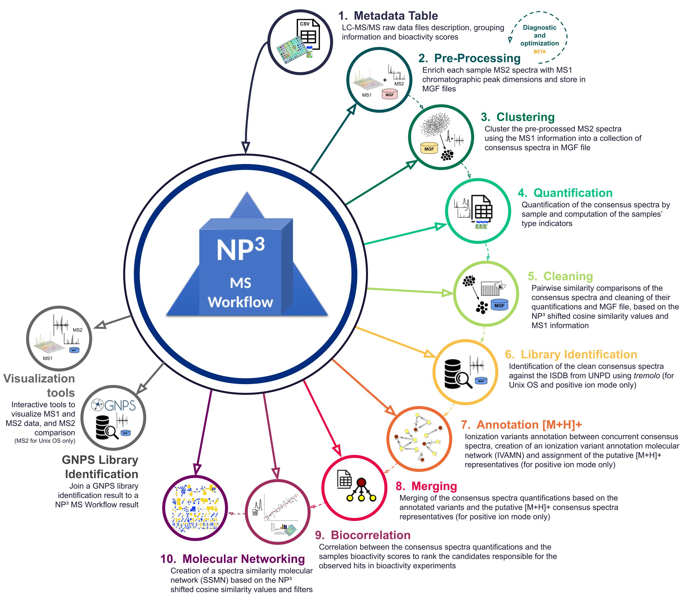

# NP³ MS Workflow 

## A Pipeline for LC-MS/MS Metabolomics Data Process and Analysis  

# Overview 

The NP³ MS workflow is a software system with a collection of scripts to enhance untargeted metabolomics research focused on drug discovery with optimizations towards natural products. 

The workflow is an automatized procedure to cluster (join) and quantify the MS2 spectra (MS/MS) associated with the same ion, which eluted in concurrent chromatographic peaks (MS1), of a collection of samples from LC-MS/MS experiments. It generates a rank of candidate spectra responsible for the observed hits in bioactivity experiments, suggests the number of metabolites present in the samples and constructs molecular networks to improve the analysis and visualization of the results.

The NP³ MS workflow consists of ten major steps, where only the first requires user intervention:

 


This workflow also contains two interactive commands for MS1 and MS2 data visualization and analysis. And a third command to join the GNPS library identification results to the NP³ MS workflow quantification tables. 

For the complete details of each command see the [NP³ MS workflow user manual](docs/Manual_NP3_workflow.pdf). 

- - - - 

# Installation with Conda 

NP³ MS workflow includes a conda environment file for Unix and Windows, enabling users to install package dependencies.  

First, download the workflow repository. 

- Click on the green button named 'Code' and then click on the 'Download ZIP' option.
    - The repository contains the entire Universal Natural Products Database (UNPD), so this download can take a while to finish. 
- Extract the zip file 

Then, download and install Anaconda with Python 3.8 from the following link:  

- https://www.anaconda.com/products/individual 

    - During installation on Windows OS check the option: 'Add Anaconda3 to my PATH environment variable'  
        - If you do not check this option you have to manually add the conda executable to your PATH environment variables 

    - To install on Unix OS run the following terminal command in the folder where the Anaconda installer was downloaded (replace 'Anaconda_installer_name' by the name of the downloaded file): 

        ```  
        $ sh Anaconda_installer_name.sh 
        ```      

        - During installation when asked 'Do you wish the installer to initialize Anaconda3 by running conda init?' answer 'yes' 

        - If you answer 'no', then you need to manually type the command `$ conda init` before using Anaconda. 

                   
To verify if the Anaconda installation was successful, open a **new** terminal window and type:   

```  
$ conda 
``` 


If it outputs the conda help usage information you are good to go.    

Now, go the NP³ MS workflow repository folder that you have just downloaded and extracted, and open a terminal window there.  

Then, create the NP³ MS workflow conda environment to automatically install almost all the workflow programs and required packages using the following terminal command:

Unix OS: 

```  
$ conda env create -f environment_np3_unix.yml 
``` 

Windows OS: 

```  
$ conda env create -f environment_np3_win.yml 
``` 

  - The conda environment installation can be a slow process, more than 5 minutes is expected. If this is taking too long to finish (probable got stuck in the 'Solving environment' step), try executing the following command first and then retry the NP³ MS workflow conda environment creation.
  
    ```
      $ conda config --set channel_priority strict
    ```

The NP³ MS workflow conda environment must be created and activated before running the NP³ MS workflow commands. If the NP³ MS workflow environment was created successfully, activate it with the following command: 

```  
$ conda activate np3 
```   

You should see the '(np3)' tag as the first thing in your terminal line. Every time you open a new terminal you must execute this command once again in order to activate the NP³ MS workflow environment before using the NP³ MS workflow commands. 

Now install the libraries required by the node.js program: 

In the terminal execute the following command: 

``` 
$ npm install shelljs@0.8.4 commander@5.1.0 
```   

Make sure all programs and OS libraries were properly installed and continue to the remaining packages installation. If you could not install the environment or failed in any of the above steps check the **manual** installation guide in the [NP³ MS workflow user manual](docs/Manual_NP3_workflow.pdf). 
  

The workflow command **setup** checks the programs and packages installation and tries to automatically install the missing ones (except for the *node.js* packages), and automatically compiles the NP3_MSCluster algorithm.  
  

For **automatically** installing the remaining packages and compiling the NP3_MSCluster algorithm, in the terminal inside the repository root folder run the following command: 

  
```  
$ node np3_workflow.js setup 
``` 

If it runs without any ERROR message you are good to go! Otherwise, look for dependencies problems and retry with superuser privileges. 
  
If the workflow command **setup** persists to fail, the programs and packages must be manually installed, and then this command must be used to automatically compile the NP3_MSCluster algorithm or it must be compiled manually (see instructions in the [NP³ MS workflow user manual](docs/Manual_NP3_workflow.pdf)). 

  
- - - - 

# Getting Started 

The input for the NP³ MS workflow are LC-MS/MS raw data files in mzXML or mzML formats (mzData format could also be used, but was not vastly tested). It supports only the positive ([M+H]+) ion mode. The negative ([M-H]-) ion mode could also be used, but the Steps 7 and 8 were not vastly tested for it and could lead to undesired results.

Let's use the samples L754_bacs present in the 'test' folder to check the installation and run the NP³ MS workflow for the first time. A metadata table (Step 1) is already provided in the 'test/L754_bacs' folder. 

Start by activating the NP³ MS workflow environment. Run the following command in the terminal: 

 
```  
$ conda activate np3 
``` 

Now, we can run the NP³ MS workflow with the provided metadata table. 

The user can choose to run the entire workflow (Steps 2 to 10) with a single command, using the default parameters in the pre-processing Step 2, or to run the pre-processing Step 2 separated, in order to optimize the LC-MS processing result, and then run the rest of the workflow with a single command (Steps 3 to 10). We **highly recommend the users to run the pre-processing Step 2 separated** to optimize its most critical parameters: the common MS1 peak width found in your data and the expected deviation between the MS1 and the MS2 data (parameters peak_width and rt_tolerance, respectively). The pre-processing results will directly impact the isomers definition throughout the rest of the workflow, a bad optimization of its critical parameters can, for example, lead to large MS1 peaks being splitted or adjacent peaks being joined, negatively impacting the final result. The users should **follow the pre-processing optimization guide** present in section 4.3.4. of the [NP³ MS Workflow user manual](docs/Manual_NP3_workflow.pdf) when executing the workflow with a new dataset.


The test dataset that we are using in this example gives good results with the pre-processing default parameters, so then we will run the entire workflow with a single command. 

In the repository root folder run the following command to execute all the workflow steps, using the provided metadata file for the L754_bacs samples: 


``` 
$ node np3_workflow.js run --output_name "L754_bacs_test" --output_path "test/L754_bacs" --metadata "test/L754_bacs/marine_bacteria_library_L754_metadata.csv" --raw_data_path "test/L754_bacs/mzxml" --verbose 1 

``` 
  

If the workflow executed without any error message, the results should be located in the folder 'test/L754_bacs/L754_bacs_test'. The contents of the result folder are explained below: 


~~~ 
L754_bacs_test 
│  
├── outs                                        <- the results from the clustering steps in separated folders, each one with results from the other workflow commands as described below 
│   │    
│   ├── L754_bacs_test                          <- the final clustering step results folder 
│   │   │ 
|   |   ├── clust                               <- the folder with clusters membership files (which SCANS or msclusterID were joined in the final clustering step) (Step3) 
│   │   │ 
|   |   ├── count_tables                        <- the folder with the quantification tables from Step 4 named as "L754_bacs_test_(spectra|peak_area).csv" and "L754_bacs_test_peak_area_MS1.csv" 
│   │   │   |    
│   │   │   ├── clean                           <- the folder with quantification tables from Steps 6, 7 and 9 
│   │   │   |  
│   │   │   └── merge                           <- the folder with quantification tables from Steps 8 and 9 
│   │   │ 
|   |   ├── mgf                                 <- the folder with the mgf files containing the resulting collection of consensus spectra (Step 3). The file L754_bacs_test_all.mgf contains all the resulting consensus spectra 
│   │   │    
|   |   └── molecular_networking                <- the folder with the similarity molecular networks and the molecular network of annotations edge files (Steps 7 and 10). One table with the attributes of the molecular network of annotations 
│   │       |   
│   │       └── similarity_tables               <- the folder with the pairwise similarity tables (Step 6) 
│   │    
│   ├── B_X_Y                                   <- the clustering steps results folders, where X is the data collection batch number in the metadata file of each group of samples and Y is 0 if it is the result of a data clustering step or 1 if it is the result of a blank clustering step 
│   │ 
│   └── B_X                                     <- the data collection batch integration step results folders, where X is the data collection batch number 
│ 
├── np3_modifications.csv                       <- a copy of the ionization variant rules table used in the job 
│ 
├── marine_bacteria_library_L754_metadata.csv   <- a copy of the metadata table used in the job 
│ 
└── logRunParms                                 <- the command line parameters values used to run the command 
~~~ 

  
For more details about what each file contains, its columns and values, and to better understand the results and how they are obtained see the documentation in the [NP³ MS workflow user manual](docs/Manual_NP3_workflow.pdf). 

- - - - 

# How to use 

The NP³ MS workflow was implemented in a command line interface (CLI) capable of automatically running all the workflow steps, except the first. The CLI have a help usage information describing the list of available NP³ MS workflow commands and their list of options (examples and more details in the [NP³ MS Workflow user manual](docs/Manual_NP3_workflow.pdf)).  

Before running any command of the workflow, the metadata table must be manually constructed, defining how the workflow will behave (Step 1). Then, the entire workflow can be executed with the command *run*, which runs Steps 2 to 10 or just Steps 3 to 10, using results obtained separately for Step 2. 

We strongly recommend to run the pre-process command (Step 2) separated when running the workflow for the first time in a new dataset. This way the most critical parameters (peak_width and rt_tolerance) can be manually tuned to achieve more accurate results in the LC-MS peak detection algorithm and processing, which also depends on the mass spectrometrer equipment and the data quality. The user should **follow the pre-processing optimization guide** present in section 4.3.4. of the [NP³ MS Workflow user manual](docs/Manual_NP3_workflow.pdf) to improve the pre-process result, and also inpect the data. The workflow default values have been tested with an UHPLC-MS/MS-qTOF equipment (Acquity HClass Waters UHPLC and ESI\-QqTOF Impact II Bruker spectrometer).

 
For further analyses, after running the entire NP³ MS workflow, each step can be executed separately on the results obtained previously and with different tolerance parameter values and/or correlation groups, as needed. When running a specific command separately it is important not to modify the original output files, instead create a copy of those files. In this way, you may reproduce the workflow steps as needed when repeating any step.
 
If you did install the workflow dependencies using the conda environments, always remember to activate the NP³ MS workflow environment before executing any of the workflow commands. To activate the NP³ MS workflow environment use the following command:


```  
$ conda activate np3 
``` 
  
## NP³ MS Workflow Commands 
  
The CLI is found in the root folder of the NP³ MS workflow repository (named np3_workflow.js) and can be run with the command: 
 
``` 
$ node np3_workflow.js [cmd] [options] 
``` 
  
Where **cmd** are the available NP³ MS workflow commands that the script can handle (the workflow steps) and **options** are the list of available options for each command. 


The list of available commands is described below together with their respectively mandatory options (the full list of options is described in each command section in the [NP³ MS workflow user manual](docs/Manual_NP3_workflow.pdf)). These lists can also be found by running the following command in the terminal: 
  

```  
$ node np3_workflow.js --help 
``` 
 

Or simple:   

```  
$ node np3_workflow -h 
```   

Commands:   

- **setup** : Check if the NP³ MS workflow dependencies are installed, try to install missing R and python packages and compile the NP3_MSCluster algorithm
 
- **run** [options] : Steps 2 to 10: Runs the entire NP³ MS workflow.
    - List of mandatory options:
    - *\-n, \-\-output_name* \<name\>      : the job name. It will be used to name the output directory and the results of the final clustering integration step
    - *\-m, \-\-metadata* \<file\>          : path to the metadata table CSV file
    - *\-d, \-\-raw_data_path* \<path\>     : path to the folder containing the input LC-MS/MS raw spectra data files (mzXML format is recommended)
    - *\-o, \-\-output_path* \<path\>       : path to where the output directory will be created
 
- **pre_process** [options] : Step 2: This command runs the pre-process of the LC-MS/MS raw data. It extracts the list of MS1 peaks with their dimension information (minimum and maximum retention times, the peak area and ID) in each sample, matches the MS2 spectra retention time and precursor m/z against this list and assign to each MS2 spectra a MS1 peak that encompasses it. Additionally, a table with the MS1 peaks without any MS2 spectrum m/z and retention time match are stored in a count table of non-fragmented MS1 peaks.
    - List of mandatory options:
    -  *\-n, \-\-data_name* \<name\>  <x>      :   the data collection name for printting in the verbose messages
    -  *\-m, \-\-metadata* \<file\> <x>         :    path to the metadata table CSV file
    -  *\-d, \-\-raw_data_path* \<path\> <x>   :    path to the folder containing the input LC-MS/MS raw spectra data files
 
- **clustering** [options] : Steps 3 and 4: This command runs the NP3_MSCluster algorithm to perform the clustering of pre-processed MS/MS data into a collection of consensus spectra. Then, it runs the consensus spectra quantification to count the number of spectra and peak area by sample (clustering counts). If necessary, it runs Step 2. And it can also run the library spectra identifications (Step 6) for the collection of consensus spectra.
    - List of mandatory options:
    - *\-n, \-\-output_name* <name>   :       the job name. It will be used to name the output directory and the results of the final clustering integration step
    - *\-m, \-\-metadata*  <file>       :      path to the metadata table CSV file
    - *\-d, \-\-raw_data_path*  <path>    :     path to the folder containing the input LC-MS/MS raw spectra data files
    -  *\-o, \-\-output_path*  <path>     :     path to where the output directory will be created

- **clean** [options] : Step 5: This command runs the pairwise comparisons of the collection of consensus spectra (if not done yet) and then runs the cleaning of the clustering counts. It also runs Step 7 to annotate possible ion variants using the new clean count tables and to create the molecular network of annotations, and runs Step 10 to overwrite any old computation of the molecular network of similarities. It can also run the library spectra identifications (Step 6) for the collection of clean consensus spectra.
    - List of mandatory options:
    - *\-m, \-\-metadata* \<file\>          : path to the metadata table CSV file
    - *\-o, \-\-output_path* \<path\>       : path to the final output data folder, inside the 'outs' directory of the clustering result folder. It should contain the 'mgf' folder and the 'count_tables' folder with the peak area and spectra count tables in CSV files. The job name will be extracted from here
    - *\-y, \-\-processed_data_dir* \<path\>  : the path to the folder inside the raw data folder where the pre-processed data (MGFs) were stored.
 
- **tremolo** [options] : Step 6: (for Unix OS only) This command runs the tremolo tool, used for spectra matching against In-Silico predicted MS/MS spectrum of Natural Products Database (ISDB) from the UNPD (Universal Natural Products Database).
    - List of mandatory options:
    - *\-o, \-\-output_path* <path>   :     path to where the spectral library search results will be stored
    - *\-g, \-\-mgf* <file>       :      path to the input MGF file with the MS/MS spectra data to be searched and identified

- **annotate_protonated** [options] : Step 7: This command runs the annotation of possible ionization variants in the clean count tables and creates the molecular network of annotations. It searches for adducts, neutral losses, multiple charges, dimers/trimers, isotopes and in-source fragmentation based on numerical equivalences and chemical rules. Finally, it runs a link analysis in the molecular network of annotations to assign some of the consensus spectra as putative [M+H]+ representatives.
    - List of mandatory options:
    - *\-m, \-\-metadata* \<file\>          : path to the metadata table CSV file
    - *\-o, \-\-output_path* \<path\>       : path to the output data folder, inside the 'outs' directory of the clustering result folder. It should contain the 'counts_table' folder and inside it the 'clean' subfolder with the clean count tables in CSV files. The name of the output folder will be used as the job name.
 
- **merge** [options] : Step 8: This command runs the merge of the clean count tables based on the annotated variants. It creates new symbolic spectra candidates representing the union of each spectra with its annotated variants. By default the merge is only performed for the consensus spectra assigned as a [M+H]+ representative ion, to better account for the quantifications of the true metabolites.
    - List of mandatory options:
    - *\-o, \-\-output_path* \<path\>       : path to the output data folder, inside the 'outs' directory of the clustering result folder. It should contain the 'counts_table' folder and inside it the 'clean' subfolder with the clean count tables in CSV files. The job name will be extracted from here
    - *\-y, \-\-processed_data_dir* \<path\>  : the path to the folder inside the raw data folder where the pre-processed data (MGFs) were stored.
    - *\-m, \-\-metadata* \<file\>          : path to the metadata table CSV file
 
- **corr** [options] : Step 9: This command runs the bioactivity correlation to rank the consensus spectra based on the scores computed for the selection of samples and bioactivity values present in the metadata table.
    - List of mandatory options:
    - *\-b, \-\-metadata* \<file\>\     : path to the metadata table CSV file. Used to retrieve the biocorrelation groups
    - *\-c, \-\-count_file_path* \<file\>\ \ \ \ \ \ \ \ \ \ : path to the count table CSV file
 
- **mn** [options] : Step 10: This command runs the creation of a molecular network of similarity based on the pairwise spectra similarity value above the given similarity cut-off. Then, a filter is applied on this network to limit the number of neighbors of each node (number of links) to the top K most similar ones and to limit the size of the components to a maximum number of nodes. The final filtered network contains components that represent the most analogous spectra, possible connecting spectra from similar chemical classes.
    - List of mandatory options:
    - *\-o, \-\-output_path* \<path\>       : path to the output data folder, inside the outs directory of the clustering result folder. It should contain the 'molecular_networking' folder and inside it the 'similarity_tables' folder. The job name will be extracted from here
 
- **gnps_result** [options] : This command join the GNPS library identification result from the Molecular Networking (download 'clustered spectra') or the Library Search (download 'All identifications') workflows to the count tables of the NP³ clustering or clean steps. 
    - List of mandatory options:
    - *\-i, \-\-cluster_info_path* \<path\>       :  If joining the result of a Molecular Networking job, this should be the path to the file inside the folder named \'clusterinfo\' of the downloaded output from GNPS. Not used for results coming from the Library Search workflow. (default: "")
    - *\-s, \-\-result_specnets_DB_path* \<path\>       : If joining the result of a Molecular Networking job, this should be the path to the file inside the folder named \'result_specnets_DB\'; and if this is the result of a Library Search workflow, this should be the path to the file inside the downloaded folder
    - *\-c, \-\-count_file_path* \<path\>       : Path to any of the count tables (peak_area or spectra) resulting from the NP³ MS workflow clustering or clean steps. If the peak_area is informed and the spectra table file exists in the same path (or the opposite), it will merge the GNPS results to both files
 
- **chr** [options] :        This command runs an interactive prompt to extract chromatogram(s) from raw MS1 data files (mzXML, mzData and mzML) and to save to PNG image files. Depending on the provided parameters this can be a total ion chromatogram (TIC - default), a base peak chromatogram (BPC) or an extracted ion chromatogram (XIC) extracted from each sample/file.

- **spectra_viewer** [options] : (for Unix OS only) This command runs an interactive Web App to visualize and compare MS2 spectra. It receives as input a MGF file or a peak list. It is also possible to manipulate, filter, calculate similarity of the spectra and save PNG or SVG plots.

- **test** [options]      :       This command runs some use cases to test the NP³ MS workflow consistency in all steps. This option is intended for debugging purposes, and is not a part of the analysis workflow.

- - - -  

### Step 1: Construction of a Metadata Table 

The metadata table must be a CSV file with columns separated by comma ',' and with the dot '.' as decimal point character. It can be created and edited in EXCEL, LibreOffice CALC or any other spreadsheet program, but must be saved in CSV (UTF-8) format. If any text name in the metadata file contains special characters, the file must be saved with the parameter to quote text cells set to TRUE. After the metadata file was finished it is recommended to open it with a simple text viewer, e.g., notepad, to make sure that the column separator character and the decimal point character were properly set. 
 
A metadata template file is available in the NP³ MS workflow repository, named 'METADATA_TEMPLATE.csv'.
 
The metadata table must contain the following mandatory columns (in uppercase):
 
- FILENAME \- the raw data file names (including extensions but not including complete paths). The accepted file format is mzXML or mzML (mzData format could also be used, but was not vastly tested).
- SAMPLE_CODE \- unique and syntactically valid (see below) names for each file. The use of the same SAMPLE_CODE in more than one entry will generate an error. A syntactically valid name must start with a letter and consist of letters, numbers, and underscore characters. R reserved words (https://cran.r-project.org/doc/manuals/r-release/R-lang.html#Reserved-words) are not syntactically valid names. The SAMPLE_CODE names will be used to name and reference the pre-processed files in Step 2 and to name the output count table's columns of Steps 3 to 9.
- DATA_COLLECTION_BATCH \- a number (starting with 1 and progressing in ascending order, e.g., 1,2,3,...) indicating to which data collection batch each sample file belongs. Files from the same data collection batch should have been collected in the same LC-MS/MS run (e.g., from the same screening or the same plate), ensuring closely related experimental conditions, and must have the same DATA_COLLECTION_BATCH number. See below more details about the order of samples in each batch.
- SAMPLE_TYPE \- one among "sample", "blank", "bed", "control" or "hit". If the sample file is a chromatographic blank this column must be set to "blank" (e.g. DMSO, solvents, etc); if the sample is the culture media (containing molecules that should be identified for later exclusion or separation) set it to "bed"; if the sample is a control (e.g. the culture media + the non-elicited microorganism) set it to "control"; if the sample is bioactive and is desired to dereplicate its m/z's, set it to "hit"; and if the file is not a blank sample nor any of the above set it to "sample". Spectra from blank, control, bed and hit samples will be used to signal possible false positive spectra and to dereplicate m/z's that appear in hit samples (see Step 4 details).
 
The metadata table may contain the following optional columns:
 
- BIOACTIVITY_\<NAME\> - zero or more columns starting with the prefix "BIOACTIVITY_" followed by a unique name \<NAME\> defining different bioactivities values for each sample. Set it to a positive number (greater or equal than zero) indicating the sample bioactivity score, it could be an inhibition or an activation of a target. These values should be normalized, e.g., from 0 to 100, to be used in the correlation computation.
- COR_\<NAME\> - zero or more columns starting with the prefix "COR_" followed by a unique name \<NAME\> defining the correlation group. Each one of these columns must have values 0 or 1. If the sample spectra or peak area count is to be used in the COR_\<NAME\> correlation with each defined bioactivity scores (BIOACTIVITY_\<NAME\> columns), set it to 1. Otherwise, set it to 0. In Step 9 each one of these columns will result in a new column for each available bioactivity score in the output count tables, containing the bioactivity correlation scores computed with the respectively selected samples. For better correlation results the selected groups of samples should belong to the same bioactivity peak, e.g., a selection that contains very active, middle active and not active samples of a same bioactivity peak (a 'hit'). We strongly recommend to use the blank, bed and control samples in this selection to eliminate false positives. Bioactivity data must be collected from chemical samples at the same concentration. LC-MS/MS data must be collected from the chemical samples at the same concentration. This will guarantee real correlations, especially if the samples and bioactivity data come from a screening of natural product samples.
- GR_\<NAME\> - zero or more columns starting with the prefix "GR_" followed by a unique name \<NAME\> defining a set of groups. Each of those columns may have one or more tags to label a group of samples. A column "GR_\<NAME\>" with groups "\<g1\>", "\<g2\>" and "\<g3\>" will bind at the final count tables the columns "\<NAME_g1\>", "\<NAME_g2\>" and "\<NAME_g3\>" with the sum of peak areas or number of spectra of the samples that belongs to each group for each m/z row. 
\newline For example, to create a set called **colors** with the groups **red**, **green** and **blue**, add to the metadata the column "GR_colors", tag the samples that belongs to the groups **red**, **green** and **blue** by filling the rows (you may have empty observations if it is necessary) and it will bind the columns **colors_red**, **colors_green** and **colors_blue** to the final count tables.
 
The user is free to add any additional column to the metadata file, for example to add relevant descriptions for each file. These additional columns will be ignored by the workflow commands, but can be useful to add information related to the job samples. It is important that additional column names are not equal or a prefix of any of the mandatory or optional columns of the metadata file.


For more details about the samples order and the bahavior of the clustering step related to the data collection batches grouping, see the section 4.1.1 Metadata Table Details of the documentation in the [NP³ MS workflow user manual](docs/Manual_NP3_workflow.pdf). 


- - - - 
